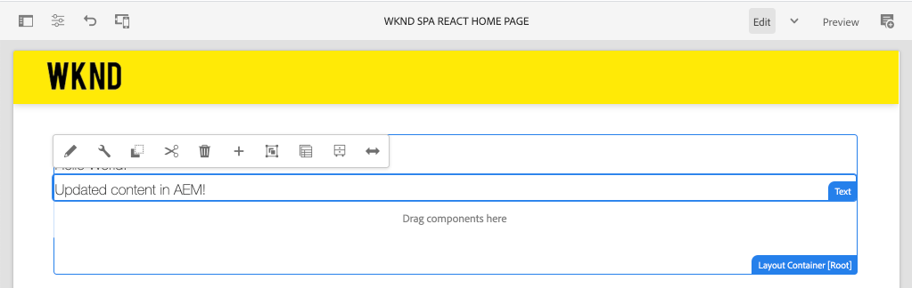

# Integrare un&#39;applicazione a pagina singola {#integrate-spa}

Scopri come il codice sorgente per un’applicazione a pagina singola scritta in React può essere integrato con un progetto Adobe Experience Manager (AEM). Scopri come utilizzare strumenti front-end moderni, come un server di sviluppo di webpack, per sviluppare rapidamente l’applicazione a pagina singola rispetto all’API del modello JSON di AEM.

## Obiettivo

1. Scopri come il progetto SPA è integrato con AEM con le librerie lato client.
2. Scopri come utilizzare un server di sviluppo webpack per lo sviluppo front-end dedicato.
3. Esplorare l&#39;utilizzo di un file **proxy** e di un file statico **mock** per lo sviluppo rispetto all&#39;API del modello JSON di AEM

## Cosa verrà creato

Questo capitolo aggiunge un semplice componente `Header` all’applicazione a pagina singola. Durante il processo di creazione di questo componente statico `Header` verranno utilizzati diversi approcci allo sviluppo di AEM SPA.



*L’applicazione a pagina singola viene estesa per aggiungere un  `Header` componente statico*

## Prerequisiti

Rivedi gli strumenti e le istruzioni necessari per configurare un [ambiente di sviluppo locale](overview.md#local-dev-environment).

### Ottieni il codice

1. Scarica il punto di partenza per questa esercitazione tramite Git:

   ```shell
   $ git clone git@github.com:adobe/aem-guides-wknd-spa.git
   $ cd aem-guides-wknd-spa
   $ git checkout React/integrate-spa-start
   ```

2. Distribuisci la base di codice in un’istanza AEM locale utilizzando Maven:

   ```shell
   $ mvn clean install -PautoInstallSinglePackage
   ```

   Se utilizzi [AEM 6.x](overview.md#compatibility) aggiungi il profilo `classic`:

   ```shell
   $ mvn clean install -PautoInstallSinglePackage -Pclassic
   ```

Puoi sempre visualizzare il codice finito su [GitHub](https://github.com/adobe/aem-guides-wknd-spa/tree/React/integrate-spa-solution) o estrarre il codice localmente passando al ramo `React/integrate-spa-solution`.

## Metodo di integrazione {#integration-approach}

Sono stati creati due moduli come parte del progetto AEM: `ui.apps` e `ui.frontend`.

Il modulo `ui.frontend` è un progetto [webpack](https://webpack.js.org/) che contiene tutto il codice sorgente SPA. La maggior parte dello sviluppo e dei test SPA verrà effettuata nel progetto webpack. Quando viene attivata una build di produzione, l’applicazione a pagina singola viene creata e compilata utilizzando un webpack. Gli artefatti compilati (CSS e Javascript) vengono copiati nel modulo `ui.apps` che viene quindi distribuito al runtime AEM.


*Una rappresentazione di alto livello dell’integrazione SPA.*

Ulteriori informazioni sulla build front-end sono disponibili [qui](https://docs.adobe.com/content/help/en/experience-manager-core-components/using/developing/archetype/uifrontend-react.html).

## Ispezionare l’integrazione SPA {#inspect-spa-integration}

Quindi, controlla il modulo `ui.frontend` per comprendere l’applicazione a pagina singola generata automaticamente dall’ [archetipo di progetto AEM](https://docs.adobe.com/content/help/en/experience-manager-core-components/using/developing/archetype/uifrontend-react.html).

1. Nell’IDE che preferisci, apri il progetto AEM per l’applicazione a pagina singola WKND. Questa esercitazione utilizzerà [Visual Studio Code IDE](https://docs.adobe.com/content/help/en/experience-manager-learn/cloud-service/local-development-environment-set-up/development-tools.html#microsoft-visual-studio-code).

   

2. Espandi ed esamina la cartella `ui.frontend`. Aprire il file `ui.frontend/package.json`

3. Sotto `dependencies` dovresti vedere diversi elementi correlati a `react` tra cui `react-scripts`

   ```json
   "react": "^16.12.0",
   "react-app-polyfill": "^1.0.5",
   "react-dom": "^16.12.0",
   "react-router-dom": "^5.1.2",
   "react-scripts": "3.4.1"
   ```

   L’ `ui.frontend` è un’applicazione React basata su [Crea app React](https://create-react-app.dev/) o CRA in breve. La versione `react-scripts` indica quale versione di CRA viene utilizzata.

4. Ci sono anche tre dipendenze con prefisso `@adobe`:

   ```json
   "@adobe/aem-react-editable-components": "^1.0.0",
   "@adobe/aem-spa-component-mapping": "^1.0.0",
   "@adobe/aem-spa-page-model-manager": "^1.0.0",
   ```

   I moduli di cui sopra costituiscono l’ [SDK JS per AEM SPA Editor](https://docs.adobe.com/content/help/en/experience-manager-65/developing/headless/spas/spa-blueprint.html) e forniscono la funzionalità per consentire la mappatura dei componenti SPA sui componenti AEM.

5. Nel file `package.json` sono definiti diversi elementi `scripts`:

   ```json
   "scripts": {
       "start": "react-scripts start",
       "build": "react-scripts build && clientlib",
       "test": "react-scripts test",
       "eject": "react-scripts eject",
   }
   ```

   Si tratta di script di build standard resi [disponibili](https://create-react-app.dev/docs/available-scripts) dall’app Create React.

   L&#39;unica differenza è l&#39;aggiunta di `&& clientlib` allo script `build`. Questa istruzione aggiuntiva è responsabile della copia dell’applicazione a pagina singola compilata nel modulo `ui.apps` come libreria lato client durante una build.

   Il modulo npm [aem-clientlib-generator](https://github.com/wcm-io-frontend/aem-clientlib-generator) viene utilizzato per facilitare questo processo.

6. Ispeziona il file `ui.frontend/clientlib.config.js`. Questo file di configurazione viene utilizzato da [aem-clientlib-generator](https://github.com/wcm-io-frontend/aem-clientlib-generator#clientlibconfigjs) per determinare come generare la libreria client.

7. Ispeziona il file `ui.frontend/pom.xml`. Questo file trasforma la cartella `ui.frontend` in un modulo [Maven](http://maven.apache.org/guides/mini/guide-multiple-modules.html). Il file `pom.xml` è stato aggiornato per utilizzare [frontend-maven-plugin](https://github.com/eirslett/frontend-maven-plugin) in **test** e **build** l’applicazione a pagina singola durante una build Maven.

8. Ispeziona il file `index.js` in `ui.frontend/src/index.js`:

   ```js
   //ui.frontend/src/index.js
   ...
   document.addEventListener('DOMContentLoaded', () => {
       ModelManager.initialize().then(pageModel => {
           const history = createBrowserHistory();
           render(
           <Router history={history}>
               <App
               history={history}
               cqChildren={pageModel[Constants.CHILDREN_PROP]}
               cqItems={pageModel[Constants.ITEMS_PROP]}
               cqItemsOrder={pageModel[Constants.ITEMS_ORDER_PROP]}
               cqPath={pageModel[Constants.PATH_PROP]}
               locationPathname={window.location.pathname}
               />
           </Router>,
           document.getElementById('spa-root')
           );
       });
   });
   ```

   `index.js` è il punto di ingresso della SPA. `ModelManager` è fornito dall’SDK JS di AEM SPA Editor. È responsabile della chiamata e dell’inserimento di `pageModel` (il contenuto JSON) nell’applicazione.

## Aggiungi un componente Intestazione {#header-component}

Quindi, aggiungi un nuovo componente all’applicazione a pagina singola e implementa le modifiche in un’istanza AEM locale.

1. Nel modulo `ui.frontend`, sotto `ui.frontend/src/components` crea una nuova cartella denominata `Header`.
2. Crea un file denominato `Header.js` sotto la cartella `Header` .

   

3. Popolare `Header.js` con quanto segue:

   ```js
   //Header.js
   import React, {Component} from 'react';
   
   export default class Header extends Component {
   
       render() {
           return (
                   <header className="Header">
                       <div className="Header-container">
                           <h1>WKND</h1>
                       </div>
                   </header>
           );
       }
   }
   ```

   Sopra c&#39;è un componente React standard che genera una stringa di testo statica.

4. Aprire il file `ui.frontend/src/App.js`. Questo è il punto di ingresso dell&#39;applicazione.
5. Effettua i seguenti aggiornamenti a `App.js` per includere l&#39;elemento statico `Header`:

   ```diff
     import { Page, withModel } from '@adobe/aem-react-editable-components';
     import React from 'react';
   + import Header from './components/Header/Header';
   
     // This component is the application entry point
     class App extends Page {
     render() {
         return (
         <div>
   +       <Header />
            {this.childComponents}
            {this.childPages}
        </div>
   ```

6. Apri un nuovo terminale e passa alla cartella `ui.frontend` ed esegui il comando `npm run build` :

   ```shell
   $ cd aem-guides-wknd-spa
   $ cd ui.frontend
   $ npm run build
   ...
   Compiled successfully.
   
   File sizes after gzip:
   
   118.95 KB (-33 B)  build/static/js/2.489f399a.chunk.js
   1.11 KB (+48 B)    build/static/js/main.6cfa5095.chunk.js
   806 B              build/static/js/runtime-main.42b998df.js
   451 B              build/static/css/main.e57bbe8a.chunk.css
   ```

7. Passa alla cartella `ui.apps` . Sotto `ui.apps/src/main/content/jcr_root/apps/wknd-spa-react/clientlibs/clientlib-react` dovresti vedere che i file SPA compilati sono stati copiati dalla cartella`ui.frontend/build`.

   

8. Torna al terminale e passa alla cartella `ui.apps` . Esegui il seguente comando Maven:

   ```shell
   $ cd ../ui.apps
   $ mvn clean install -PautoInstallPackage
   ...
   [INFO] ------------------------------------------------------------------------
   [INFO] BUILD SUCCESS
   [INFO] ------------------------------------------------------------------------
   [INFO] Total time:  9.629 s
   [INFO] Finished at: 2020-05-04T17:48:07-07:00
   [INFO] ------------------------------------------------------------------------
   ```

   Questo distribuirà il pacchetto `ui.apps` a un&#39;istanza in esecuzione locale di AEM.

9. Apri una scheda del browser e passa a [http://localhost:4502/editor.html/content/wknd-spa-react/us/en/home.html](http://localhost:4502/editor.html/content/wknd-spa-react/us/en/home.html). Ora dovresti vedere il contenuto del componente `Header` visualizzato nell’applicazione a pagina singola.

   

   I passaggi 6-8 vengono eseguiti automaticamente quando si attiva una build Maven dalla directory principale del progetto (ovvero `mvn clean install -PautoInstallSinglePackage`). È ora necessario comprendere le nozioni di base dell’integrazione tra le librerie lato client SPA e AEM. Tieni presente che puoi comunque modificare e aggiungere componenti `Text` in AEM sotto il componente statico `Header` .

## Webpack Dev Server - Proxy dell&#39;API JSON {#proxy-json}

Come visto negli esercizi precedenti, l’esecuzione di una build e la sincronizzazione della libreria client con un’istanza locale di AEM richiede alcuni minuti. Questo è accettabile per il test finale, ma non è ideale per la maggior parte dello sviluppo SPA.

Un [webpack-dev-server](https://webpack.js.org/configuration/dev-server/) può essere utilizzato per sviluppare rapidamente l&#39;applicazione a pagina singola. L’applicazione a pagina singola è guidata da un modello JSON generato da AEM. In questo esercizio il contenuto JSON da un&#39;istanza in esecuzione di AEM sarà **proxy** nel server di sviluppo.

1. Torna all’IDE e apri il file `ui.frontend/package.json`.

   Cerca una riga come la seguente:

   ```json
   "proxy": "http://localhost:4502",
   ```

   Il [Create React App](https://create-react-app.dev/docs/proxying-api-requests-in-development) fornisce un meccanismo semplice per proxy delle richieste API. Tutte le richieste sconosciute verranno proxy tramite `localhost:4502`, l’avvio rapido AEM locale.

2. Apri una finestra terminale e passa alla cartella `ui.frontend` . Esegui il comando `npm start`:

   ```shell
   $ cd ui.frontend
   $ npm start
   ...
   Compiled successfully!
   
   You can now view wknd-spa-react in the browser.
   
   Local:            http://localhost:3000
   On Your Network:  http://192.168.86.136:3000
   
   Note that the development build is not optimized.
   To create a production build, use npm run build.
   ```

3. Apri una nuova scheda del browser (se non è già aperta) e passa a [http://localhost:3000/content/wknd-spa-react/us/en/home.html](http://localhost:3000/content/wknd-spa-react/us/en/home.html).

   

   Dovresti visualizzare lo stesso contenuto di AEM, ma senza che sia abilitata alcuna delle funzionalità di authoring.

   >[!NOTE]
   >
   > A causa dei requisiti di sicurezza di AEM, dovrai aver effettuato l’accesso all’istanza AEM locale (http://localhost:4502) nello stesso browser ma in una scheda diversa.

4. Torna all’IDE e crea una nuova cartella denominata `media` in `ui.frontend/src/media`.
5. Scarica e aggiungi il seguente logo WKND alla cartella `media` :

   

6. Apri `Header.js` in `ui.frontend/src/components/Header/Header.js` e importa il logo:

   ```diff
     import React, {Component} from 'react';
   + import wkndLogoDark from '../../media/wknd-logo-dk.png';
   ```

7. Effettua i seguenti aggiornamenti a `Header.js` per includere il logo come parte dell’intestazione:

   ```js
    export default class Header extends Component {
   
       get logo() {
           return (
               <div className="Logo">
                   
               </div>
           );
       }
   
       render() {
           return (
                   <header className="Header">
                       <div className="Header-container">
                           {this.logo}
                       </div>
                   </header>
           );
       }
   }
   ```

   Salva le modifiche apportate a `Header.js`.

8. Torna al browser all&#39;indirizzo [http://localhost:3000/content/wknd-spa-react/us/en/home.html](http://localhost:3000/content/wknd-spa-react/us/en/home.html). Dovresti vedere immediatamente le modifiche apportate all’app.

   

   È possibile continuare a eseguire aggiornamenti dei contenuti in AEM e visualizzarli riflessi in **webpack-dev-server**, in quanto il contenuto viene sottoposto a proxy.

9. Arrestare il server di sviluppo del webpack con `ctrl+c` nel terminale.

## Webpack Dev Server - Mock API JSON {#mock-json}

Un altro approccio per un rapido sviluppo è quello di utilizzare un file JSON statico per agire come modello JSON. &quot;prendendo in giro&quot; il JSON, rimuoviamo la dipendenza da un’istanza AEM locale. Consente inoltre a uno sviluppatore front-end di aggiornare il modello JSON per testare la funzionalità e apportare modifiche all’API JSON che verranno implementate in seguito da uno sviluppatore back-end.

La configurazione iniziale del JSON fittizio **richiede un&#39;istanza AEM locale**.

1. Nel browser passa a [http://localhost:4502/content/wknd-spa-react/us/en.model.json](http://localhost:4502/content/wknd-spa-react/us/en.model.json).

   Si tratta del JSON esportato da AEM che guida l’applicazione. Copia l’output JSON.

2. Torna all’IDE passa a `ui.frontend/public` e aggiungi una nuova cartella denominata `mock-content`.
3. Crea un nuovo file denominato `mock.model.json` sotto a `ui.frontend/public/mock-content`. Incolla l’output JSON da **Passaggio 1** qui.

   

4. Apri il file `index.html` in `ui.frontend/public/index.html`. Aggiorna la proprietà metadati per il modello di pagina AEM in modo che punti a una variabile `%REACT_APP_PAGE_MODEL_PATH%`:

   ```html
       <!-- AEM page model -->
       <meta
          property="cq:pagemodel_root_url"
          content="%REACT_APP_PAGE_MODEL_PATH%"
       />
   ```

   L&#39;utilizzo di una variabile per il valore di `cq:pagemodel_root_url` renderà più facile passare dal modello proxy al modello json fittizio.

5. Apri il file `ui.frontend/.env.development` e apporta i seguenti aggiornamenti per commentare il valore precedente per `REACT_APP_PAGE_MODEL_PATH`:

   ```plain
   PUBLIC_URL=/
   
   #REACT_APP_PAGE_MODEL_PATH=/content/wknd-spa-react/us/en.model.json
   REACT_APP_PAGE_MODEL_PATH=/mock-content/mock.model.json
   
   REACT_APP_ROOT=/content/wknd-spa-react/us/en/home.html
   ```

6. Se è in esecuzione, arrestare il **webpack-dev-server**. Avviare il **webpack-dev-server** dal terminale:

   ```shell
   $ cd ui.frontend
   $ npm start
   ```

   Passa a [http://localhost:3000/content/wknd-spa-react/us/en/home.html](http://localhost:3000/content/wknd-spa-react/us/en/home.html) e dovresti visualizzare l&#39;applicazione a pagina singola con lo stesso contenuto utilizzato nel file json **proxy**.

7. Apporta una piccola modifica al file `mock.model.json` creato in precedenza. Dovresti visualizzare il contenuto aggiornato immediatamente riportato nel **webpack-dev-server**.

   

La possibilità di manipolare il modello JSON e visualizzare gli effetti su un’applicazione a pagina singola live può aiutare uno sviluppatore a comprendere l’API del modello JSON. Consente inoltre lo sviluppo front-end e back-end in parallelo.

Ora puoi alternare il punto in cui utilizzare il contenuto JSON attivando le voci nel file `env.development` :

```plain
# JSON API via proxy to AEM
#REACT_APP_PAGE_MODEL_PATH=/content/wknd-spa-react/us/en.model.json

# JSON API via static mock file
REACT_APP_PAGE_MODEL_PATH=/mock-content/mock.model.json
```

## Aggiungi stili con ass

Una best practice React consiste nel mantenere ogni componente modulare e indipendente. Una raccomandazione generale è quella di evitare di riutilizzare lo stesso nome della classe CSS tra i componenti, che rendono l’uso dei preprocessori meno potente. Questo progetto utilizzerà [Sass](https://sass-lang.com/) per alcune funzioni utili come le variabili. Questo progetto seguirà inoltre liberamente le [convenzioni di denominazione CSS SUIT](https://github.com/suitcss/suit/blob/master/doc/components.md). SUIT è una variante della notazione BEM, modificatore elemento blocco, utilizzata per creare regole CSS coerenti.

1. Apri una finestra terminale e arresta il **webpack-dev-server** se avviato. Dall&#39;interno della cartella `ui.frontend` inserisci il seguente comando in [installa Sass](https://create-react-app.dev/docs/adding-a-sass-stylesheet):

   ```shell
   $ cd ui.frontend
   $ npm install node-sass --save
   ```

   Installa `sass` come dipendenza peer:

   ```shell
   $ npm install sass --save
   ```

2. Installa `normalize-scss` per normalizzare gli stili tra i browser:

   ```shell
   $ npm install normalize-scss
   ```

3. Avvia il **webpack-dev-server** in modo da visualizzare gli stili aggiornati in tempo reale:

   ```shell
   $ npm start
   ```

   Utilizza l’approccio Proxy of Mock per gestire l’API del modello JSON.

4. Torna all’IDE e, sotto `ui.frontend/src`, crea una nuova cartella denominata `styles`.
5. Crea un nuovo file sotto `ui.frontend/src/styles` denominato `_variables.scss` e popolalo con le seguenti variabili:

   ```scss
   //_variables.scss
   
   //== Colors
   //
   //## Gray and brand colors for use across theme.
   
   $black:                  #202020;
   $gray:                   #696969;
   $gray-light:             #EBEBEB;
   $gray-lighter:           #F7F7F7;
   $white:                  #FFFFFF;
   $yellow:                 #FFEA00;
   $blue:                   #0045FF;
   
   
   //== Typography
   //
   //## Font, line-height, and color for body text, headings, and more.
   
   $font-family-sans-serif:  "Helvetica Neue", Helvetica, Arial, sans-serif;
   $font-family-serif:       Georgia, "Times New Roman", Times, serif;
   $font-family-base:        $font-family-sans-serif;
   $font-size-base:          18px;
   
   $line-height-base:        1.5;
   $line-height-computed:    floor(($font-size-base * $line-height-base));
   
   // Functional Colors
   $brand-primary:             $yellow;
   $body-bg:                   $white;
   $text-color:                $black;
   $text-color-inverse:        $gray-light;
   $link-color:                $blue;
   
   //Layout
   $max-width: 1024px;
   
   // Spacing
   $gutter-padding: 12px;
   ```

6. Rinomina l’estensione del file `index.css` in `ui.frontend/src/index.css` in **`index.scss`**. Sostituisci il contenuto con quanto segue:

   ```scss
   /* index.scss * /
   
   /* Normalize */
   @import '~normalize-scss/sass/normalize';
   
   @import './styles/variables';
   
   body {
       background-color: $body-bg;
       font-family: $font-family-base;
       margin: 0;
       padding: 0;
       font-size: $font-size-base;
       text-align: left;
       color: $text-color;
       line-height: $line-height-base;
   }
   
   //spacing for header
   body.page {
       padding-top: 75px;
   }
   ```

7. Aggiorna `ui.frontend/src/index.js` per includere il `index.scss` rinominato:

   ```diff
    ...
   - import './index.css';
   + import './index.scss';
    ....
   ```

8. Crea un nuovo file denominato `Header.scss` sotto a `ui.frontend/src/components/Header`. Compila il file con le seguenti caratteristiche:

   ```scss
   @import '../../styles/variables';
   
   .Header {
       width: 100%;
       position: fixed;
       top: 0;
       left:0;
       z-index: 99;
       background-color: $brand-primary;
       box-shadow: 0px 0px 10px 0px rgba(0, 0, 0, 0.24);
   }
   
   .Header-container {
       display: flex;
       max-width: $max-width;
       margin: 0 auto;
       padding-left: $gutter-padding;
       padding-right: $gutter-padding;
   }
   
   .Logo {
       z-index: 100;
       display: flex;
       padding-top: $gutter-padding;
       padding-bottom: $gutter-padding;
   }
   
   .Logo-img {
       width: 100px;
   }
   ```

9. Includi `Header.scss` aggiornando `Header.js`:

   ```js
   import React, {Component} from 'react';
   import wkndLogoDark from '../../media/wknd-logo-dk.png';
   
   require('./Header.scss');
   ...
   ```

10. Torna al browser e al **webpack-dev-server**: [http://localhost:3000/content/wknd-spa-react/us/en/home.html](http://localhost:3000/content/wknd-spa-react/us/en/home.html)

   

   Ora dovresti vedere gli stili aggiornati aggiunti al componente `Header` .

## Distribuzione di aggiornamenti SPA in AEM

Le modifiche apportate a `Header` sono attualmente visibili solo tramite il **webpack-dev-server**. Distribuisci l’applicazione a pagina singola aggiornata in AEM per visualizzare le modifiche.

1. Passa alla directory principale del progetto (`aem-guides-wknd-spa`) e distribuisci il progetto in AEM utilizzando Maven:

   ```shell
   $ cd ..
   $ mvn clean install -PautoInstallSinglePackage
   ```

2. Passa a [http://localhost:4502/editor.html/content/wknd-spa-react/us/en/home.html](http://localhost:4502/editor.html/content/wknd-spa-react/us/en/home.html). Dovresti visualizzare il `Header` aggiornato con logo e stili applicati.

   

   Ora che l’applicazione a pagina singola aggiornata è in AEM, l’authoring può continuare.

## Risoluzione dei problemi relativi all&#39;errore del nodo

Durante lo sviluppo, potresti riscontrare il seguente errore:

```
Error: Missing binding aem-guides-wknd-spa/ui.frontend/node_modules/node-sass/vendor/darwin-x64-72/binding.node
Node Sass could not find a binding for your current environment: macOS 64-bit with Node.js 12.x
```

Questo può verificarsi quando la versione locale di **Node.js** e **npm** è diversa da quella utilizzata da [frontend-maven-plugin](https://github.com/eirslett/frontend-maven-plugin). L&#39;esecuzione del comando `npm rebuild node-sass` può risolvere temporaneamente il problema o rimuovere la cartella `ui.frontend/node_modules` e reinstallare.

Ci sono anche alcuni modi per affrontare questo problema in modo più permanente.

* Assicurati che la versione locale di npm e Node.js corrisponda alle versioni utilizzate da [Maven build](https://github.com/adobe/aem-guides-wknd-spa/blob/React/latest/pom.xml#L118)
* Aggiungi il seguente passaggio di esecuzione al passaggio `ui.frontend/pom.xml` prima di `npm run build` :

   ```xml
   <execution>
       <id>npm rebuild node-sass</id>
       <goals>
           <goal>npm</goal>
       </goals>
       <configuration>
           <arguments>rebuild node-sass</arguments>
       </configuration>
   </execution>
   ```

## Congratulazioni! {#congratulations}

Congratulazioni, hai aggiornato l’applicazione a pagina singola ed esplorato l’integrazione con AEM! Ora conosci due diversi approcci per lo sviluppo dell’applicazione a pagina singola rispetto all’API del modello JSON di AEM utilizzando un **webpack-dev-server**.

Puoi sempre visualizzare il codice finito su [GitHub](https://github.com/adobe/aem-guides-wknd-spa/tree/React/integrate-spa-solution) o estrarre il codice localmente passando al ramo `React/integrate-spa-solution`.

### Passaggi successivi {#next-steps}

[Mappatura di componenti SPA su componenti AEM](map-components.md)  - Scopri come mappare i componenti React su componenti Adobe Experience Manager (AEM) con l’SDK JS per AEM SPA Editor. La mappatura dei componenti consente agli utenti di effettuare aggiornamenti dinamici ai componenti SPA all’interno dell’Editor SPA di AEM, in modo simile alla tradizionale creazione di AEM.
