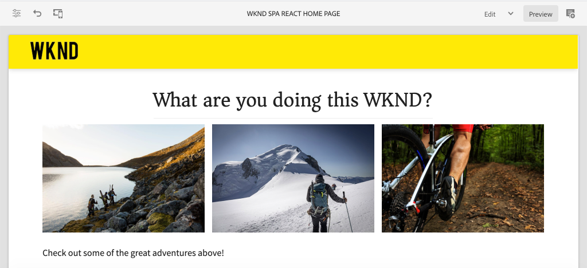
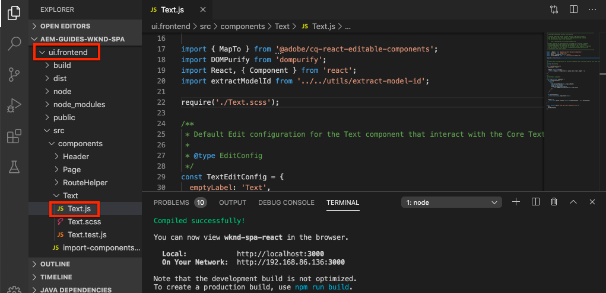
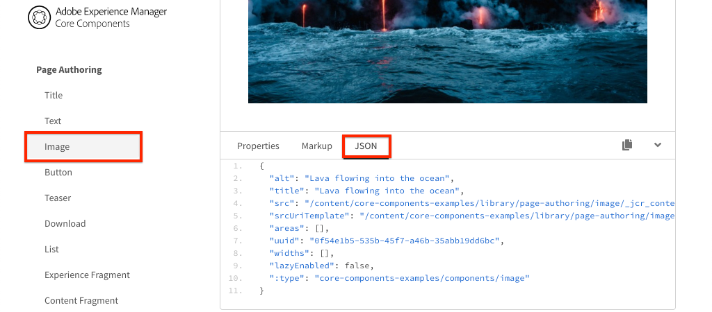
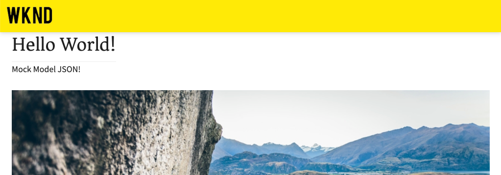

# Mappare SPA componenti a AEM componenti {#map-components}

Scoprite come mappare i componenti React ai componenti Adobe Experience Manager (AEM) con l’SDK JS di AEM SPA Editor. La mappatura dei componenti consente agli utenti di effettuare aggiornamenti dinamici ai componenti SPA nell’editor SPA AEM, in modo simile all’authoring AEM tradizionale.

Questo capitolo descrive in modo più approfondito l’API del modello JSON AEM e come il contenuto JSON esposto da un componente AEM può essere inserito automaticamente in un componente React come prop.

## Obiettivo

1. Scopri come mappare AEM componenti su SPA componenti.
2. Comprendere la differenza tra i componenti **Container** e i componenti **Content**.
3. Crea un nuovo componente React che viene mappato su un componente AEM esistente.

## Cosa verrà creato

In questo capitolo viene analizzato il modo in cui il componente `Text` SPA fornito viene mappato sul componente AEM `Text`. Viene creato un nuovo componente `Image` SPA che può essere utilizzato nella SPA e creato in AEM. Le funzioni predefinite dei criteri **Contenitore di layout** e **Editor modelli** verranno utilizzate anche per creare una visualizzazione leggermente più varia nell&#39;aspetto.



## Prerequisiti

Esaminare le istruzioni e gli strumenti necessari per configurare un ambiente di sviluppo locale [](overview.md#local-dev-environment).

### Ottenere il codice

1. Scarica il punto di partenza per questa esercitazione tramite Git:

   ```shell
   $ git clone git@github.com:adobe/aem-guides-wknd-spa.git
   $ cd aem-guides-wknd-spa
   $ git checkout React/map-components-start
   ```

2. Distribuire la base di codice in un&#39;istanza AEM locale utilizzando Maven:

   ```shell
   $ mvn clean install -PautoInstallSinglePackage
   ```

   Se si utilizza [AEM 6.x](overview.md#compatibility) aggiungere il profilo `classic`:

   ```shell
   $ mvn clean install -PautoInstallSinglePackage -Pclassic
   ```

È sempre possibile visualizzare il codice finito su [GitHub](https://github.com/adobe/aem-guides-wknd-spa/tree/React/map-components-solution) o estrarre il codice localmente passando al ramo `React/map-components-solution`.

## Approccio di mappatura

Il concetto di base consiste nel mappare un componente SPA a un componente AEM. AEM componenti, eseguite lato server, esportate il contenuto come parte dell&#39;API del modello JSON. Il contenuto JSON viene utilizzato dall&#39;SPA, che esegue lato client nel browser. Viene creata una mappatura 1:1 tra SPA componenti e un componente AEM.


*Panoramica di alto livello sulla mappatura di un componente AEM a un componente React*

##  Inspect il componente Testo

Il [AEM Project Archetype](https://github.com/adobe/aem-project-archetype) fornisce un componente `Text` mappato sul AEM [Text component](https://docs.adobe.com/content/help/en/experience-manager-core-components/using/components/text.html). Questo è un esempio di un componente **content**, in quanto esegue il rendering di *content* dal AEM.

Vediamo come funziona il componente.

###  Inspect il modello JSON

1. Prima di passare al codice SPA, è importante comprendere il modello JSON AEM fornito. Passare alla [Libreria componenti core](https://www.aemcomponents.dev/content/core-components-examples/library/page-authoring/text.html) e visualizzare la pagina del componente Testo. La libreria dei componenti core fornisce esempi di tutti i componenti core AEM.
2. Selezionare la scheda **JSON** per uno degli esempi seguenti:

   

   Vengono visualizzate tre proprietà: `text`, `richText` e `:type`.

   `:type` è una proprietà riservata che elenca il  `sling:resourceType` (o percorso) del componente AEM. Il valore di `:type` viene utilizzato per mappare il componente AEM sul componente SPA.

   `text` e  `richText` sono proprietà aggiuntive che verranno esposte al componente SPA.

###  Inspect il componente Testo

1. Apri un nuovo terminale e passa alla cartella `ui.frontend` all&#39;interno del progetto. Eseguire `npm install` e quindi `npm start` per avviare il **webpack-dev-server**:

   ```shell
   $ cd ui.frontend
   $ npm install
   $ npm start
   ```

   Il modulo `ui.frontend` è attualmente configurato per l&#39;utilizzo del modello [JSON modello ](./integrate-spa.md#mock-json).

2. Viene visualizzata una nuova finestra del browser che si apre su [http://localhost:3000/content/wknd-spa-react/us/en/home.html](http://localhost:3000/content/wknd-spa-react/us/en/home.html)

   

3. Nell’IDE di vostra scelta, aprite il progetto AEM per il SPA WKND. Espandere il modulo `ui.frontend` e aprire il file `Text.js` in `ui.frontend/src/components/Text/Text.js`:

   

4. La prima area che esamineremo è la `class Text` in ~line 40:

   ```js
   class Text extends Component {
   
       get richTextContent() {
           return (<div
                   id={extractModelId(this.props.cqPath)}
                   data-rte-editelement
                   dangerouslySetInnerHTML={{__html: DOMPurify.sanitize(this.props.text)}} />
                   );
       }
   
       get textContent() {
           return <div>{this.props.text}</div>;
       }
   
       render() {
           return this.props.richText ? this.richTextContent : this.textContent;
       }
   }
   ```

   `Text` è un componente React standard. Il componente utilizza `this.props.richText` per determinare se il contenuto di cui eseguire il rendering sarà RTF o normale. Il &quot;contenuto&quot; effettivo utilizzato proviene da `this.props.text`. Per evitare un potenziale attacco XSS, il testo RTF viene salvato in sequenza tramite `DOMPurify` prima di utilizzare [pericolosamenteSetInnerHTML](https://reactjs.org/docs/dom-elements.html#dangerouslysetinnerhtml) per eseguire il rendering del contenuto. Ricordare le proprietà `richText` e `text` dal modello JSON prima dell&#39;esercizio.

5. Date un&#39;occhiata alla `TextEditConfig` in ~line 29:

   ```js
   const TextEditConfig = {
   emptyLabel: 'Text',
   
       isEmpty: function(props) {
           return !props || !props.text || props.text.trim().length < 1;
       }
   };
   ```

   Il codice riportato sopra ha il compito di determinare quando eseguire il rendering del segnaposto nell’ambiente di authoring AEM. Se il metodo `isEmpty` restituisce **true**, verrà eseguito il rendering del segnaposto.

6. Infine, guarda la `MapTo` chiamata a ~line 62:

   ```js
   export default MapTo('wknd-spa-react/components/text')(Text, TextEditConfig);
   ```

   `MapTo` è fornito dall’SDK JS dell’editor SPA AEM (`@adobe/aem-react-editable-components`). Il percorso `wknd-spa-react/components/text` rappresenta la `sling:resourceType` del componente AEM. Questo percorso viene associato al `:type` esposto dal modello JSON osservato in precedenza. `MapTo` analizza la risposta del modello JSON e passa i valori corretti  `props` al componente SPA.

   È possibile trovare la definizione AEM `Text` del componente in `ui.apps/src/main/content/jcr_root/apps/wknd-spa-react/components/text`.

7. Provate modificando il file `mock.model.json` in `ui.frontend/public/mock-content/mock.model.json`. In ~riga 62 aggiornare il primo valore `Text` per utilizzare i tag **`H1`** e **`u`**:

   ```json
       "text": {
           "text": "<h1><u>Hello World!</u></h1>",
           "richText": true,
           ":type": "wknd-spa-react/components/text"
       }
   ```

   Andate a [http://localhost:3000](Http://localhost:3000) per vedere gli effetti:

   

   Provate a alternare la proprietà `richText` tra **true** / **false** per visualizzare la logica di rendering in azione.

8.  Inspect `Text.scss` in `ui.frontend/src/components/Text/Text.scss`.

   Questo file è stato aggiunto dalla base di codice iniziale per questo capitolo e utilizza la funzione [Sass](https://sass-lang.com/) aggiunta nel capitolo precedente. Prendete nota delle variabili cui si fa riferimento da `ui.frontend/src/styles/_variables.scss`.

## Creare il componente Immagine

Quindi, create un componente `Image` React che viene mappato sul AEM [componente Immagine](https://docs.adobe.com/content/help/it-IT/experience-manager-core-components/using/components/image.html). Il componente `Image` è un altro esempio di un componente **content**.

###  Inspect JSON

Prima di passare al codice SPA, ispezionare il modello JSON fornito da AEM.

1. Andate agli [esempi di immagini nella libreria dei componenti core](https://www.aemcomponents.dev/content/core-components-examples/library/page-authoring/image.html).

   

   Le proprietà di `src`, `alt` e `title` verranno utilizzate per compilare il componente SPA `Image`.

   >[!NOTE]
   >
   > Esistono altre proprietà Immagine esposte (`lazyEnabled`, `widths`) che consentono a uno sviluppatore di creare un componente adattivo e a caricamento lento. Il componente creato in questa esercitazione sarà semplice e **non** utilizzerà queste proprietà avanzate.

2. Tornate all&#39;IDE e aprite il percorso `mock.model.json` in `ui.frontend/public/mock-content/mock.model.json`. Poiché questo è un nuovo componente per il nostro progetto, dobbiamo &quot;prendere in giro&quot; il JSON Immagine.

   In ~riga 70 aggiungere una voce JSON per il modello `image` (non dimenticare la virgola finale `,` dopo il secondo `text_23828680`) e aggiornare l&#39;array `:itemsOrder`.

   ```json
   ...
   ":items": {
               ...
               "text_23828680": {
                   "text": "<p>Mock Model JSON!</p>",
                   "richText": true,
                   ":type": "wknd-spa-react/components/text"
               },
               "image": {
                   "alt": "Rock Climber in New Zealand",
                   "title": "Rock Climber in New Zealand",
                   "src": "/mock-content/adobestock-140634652.jpeg",
                   ":type": "wknd-spa-react/components/image"
               }
           },
           ":itemsOrder": [
               "text",
               "text_23828680",
               "image"
           ],
   ```

   Il progetto include un&#39;immagine di esempio in `/mock-content/adobestock-140634652.jpeg` che verrà utilizzata con il **webpack-dev-server**.

   È possibile visualizzare il [mock.model.json completo qui](https://github.com/adobe/aem-guides-wknd-spa/blob/React/map-components-solution/ui.frontend/public/mock-content/mock.model.json).

### Implementare il componente Immagine

1. Quindi, create una nuova cartella denominata `Image` in `ui.frontend/src/components`.
2. Sotto la cartella `Image` create un nuovo file denominato `Image.js`.

   

3. Aggiungete le seguenti istruzioni `import` a `Image.js`:

   ```js
   import React, {Component} from 'react';
   import {MapTo} from '@adobe/aem-react-editable-components';
   ```

4. Quindi aggiungete il simbolo `ImageEditConfig` per determinare quando mostrare il segnaposto in AEM:

   ```js
   export const ImageEditConfig = {
   
       emptyLabel: 'Image',
   
       isEmpty: function(props) {
           return !props || !props.src || props.src.trim().length < 1;
       }
   };
   ```

   Il segnaposto viene visualizzato se la proprietà `src` non è impostata.

5. Implementare quindi la classe `Image`:

   ```js
    export default class Image extends Component {
   
       get content() {
           return ;
       }
   
       render() {
           if(ImageEditConfig.isEmpty(this.props)) {
               return null;
           }
   
           return (
                   <div className="Image">
                       {this.content}
                   </div>
           );
       }
   }
   ```

   Il codice riportato sopra eseguirà il rendering di un `` basato sulle proprietà `src`, `alt` e `title` passate dal modello JSON.

6. Aggiungete il codice `MapTo` per mappare il componente React al componente AEM:

   ```js
   MapTo('wknd-spa-react/components/image')(Image, ImageEditConfig);
   ```

   Notare che la stringa `wknd-spa-react/components/image` corrisponde alla posizione del componente AEM in `ui.apps` in: `ui.apps/src/main/content/jcr_root/apps/wknd-spa-react/components/image`.

7. Create un nuovo file denominato `Image.scss` nella stessa directory e aggiungete quanto segue:

   ```scss
   .Image-src {
       margin: 1rem 0;
       width: 100%;
       border: 0;
   }
   ```

8. In `Image.js` aggiungere un riferimento al file nella parte superiore sotto le istruzioni `import`:

   ```js
   import React, {Component} from 'react';
   import {MapTo} from '@adobe/aem-react-editable-components';
   
   require('./Image.scss');
   ```

   È possibile visualizzare il file [Image.js completato qui](https://github.com/adobe/aem-guides-wknd-spa/blob/React/map-components-solution/ui.frontend/src/components/Image/Image.js).

9. Aprire il file `ui.frontend/src/components/import-components.js` e aggiungere un riferimento al nuovo componente `Image`:

   ```js
   import './Page/Page';
   import './Text/Text';
   import './Image/Image'; //add reference to Image component
   ```

10. Se non è già stato avviato, avviare il **webpack-dev-server**. Andate a [http://localhost:3000](Http://localhost:3000) e dovrebbe essere visualizzato il rendering dell&#39;immagine:

   

   >[!NOTE]
   >
   > **Sfida** bonus: Implementate un nuovo metodo  `Image.js` per visualizzare il valore di  `this.props.title` come didascalia sotto l’immagine.

## Aggiorna criteri in AEM

Il componente `Image` è visibile solo nel **webpack-dev-server**. Quindi, distribuite il SPA aggiornato per AEM e aggiornare i criteri dei modelli.

1. Arrestate il **webpack-dev-server** e, dalla radice del progetto, implementate le modifiche per AEM utilizzando le vostre abilità Maven:

   ```shell
   $ cd aem-guides-wknd-spa
   $ mvn clean install -PautoInstallSinglePackage
   ```

2. Dalla schermata iniziale AEM passare a **Strumenti** > **Modelli** > **[WKND SPA React](http://localhost:4502/libs/wcm/core/content/sites/templates.html/conf/wknd-spa-react)**.

   Selezionare e modificare la **SPA pagina**:

   

3. Selezionare il **Contenitore di layout** e fare clic sull&#39;icona **policy** per modificare il criterio:

   

4. In **Componenti consentiti** > **SPA WKND React - Content** > selezionare il componente **Immagine**:

   

   In **Componenti predefiniti** > **Aggiungi mappatura** e scegliete il componente **Immagine - WKND SPA React - Content**:

   

   Immettere un **tipo mime** di `image/*`.

   Fate clic su **Fine** per salvare gli aggiornamenti dei criteri.

5. In **Contenitore di layout** fare clic sull&#39;icona **policy** per il componente **Testo**:

   

   Create un nuovo criterio denominato **WKND SPA Text**. In **Plugins** > **Formattazione** > selezionare tutte le caselle per abilitare ulteriori opzioni di formattazione:

   

   In **Plugins** > **Stili di paragrafo** > selezionare la casella di controllo **Abilita stili di paragrafo**:

   

   Fate clic su **Fine** per salvare l&#39;aggiornamento del criterio.

6. Andate alla **homepage** [http://localhost:4502/editor.html/content/wknd-spa-react/us/en/home.html](http://localhost:4502/editor.html/content/wknd-spa-react/us/en/home.html).

   È inoltre necessario poter modificare il componente `Text` e aggiungere altri stili di paragrafo in modalità **schermo intero**.

   

7. È inoltre necessario essere in grado di trascinare un&#39;immagine da **Asset Finder**:

   

8. Aggiungete le vostre immagini tramite [ AEM Assets](http://localhost:4502/assets.html/content/dam) oppure installate la base di codice finita per il sito di riferimento standard [WKND](https://github.com/adobe/aem-guides-wknd/releases/latest). Il [sito di riferimento WKND](https://github.com/adobe/aem-guides-wknd/releases/latest) include molte immagini che possono essere riutilizzate sul SPA WKND. Il pacchetto può essere installato utilizzando [AEM Package Manager](http://localhost:4502/crx/packmgr/index.jsp).

   

##  Inspect il Contenitore di layout

Il supporto per il **Contenitore di layout** viene fornito automaticamente dall&#39;SDK dell&#39;editor SPA AEM. Il **Contenitore di layout**, come indicato dal nome, è un componente **contenitore**. I componenti contenitore sono componenti che accettano strutture JSON che rappresentano *altri componenti* e le istanziano in modo dinamico.

Esaminiamo ulteriormente il Contenitore di layout.

1. In un browser passare a [http://localhost:4502/content/wknd-spa-react/us/en.model.json](http://localhost:4502/content/wknd-spa-react/us/en.model.json)

   

   Il componente **Contenitore di layout** ha un `sling:resourceType` di `wcm/foundation/components/responsivegrid` ed è riconosciuto dall&#39;editor SPA utilizzando la proprietà `:type`, proprio come i componenti `Text` e `Image`.

   Le stesse funzionalità di ridimensionamento di un componente con [Modalità Layout](https://docs.adobe.com/content/help/en/experience-manager-65/authoring/siteandpage/responsive-layout.html#defining-layouts-layout-mode) sono disponibili con l&#39;editor SPA.

2. Tornate a [http://localhost:4502/editor.html/content/wknd-spa-react/us/en/home.html](http://localhost:4502/editor.html/content/wknd-spa-react/us/en/home.html). Aggiungete altri componenti **Image** e provate a ridimensionarli utilizzando l&#39;opzione **Layout**:

   

3. Riaprite il modello JSON [http://localhost:4502/content/wknd-spa-react/us/en.model.json](http://localhost:4502/content/wknd-spa-react/us/en.model.json) e osservate il modello `columnClassNames` come parte del JSON:

   

   Il nome della classe `aem-GridColumn--default--4` indica che il componente deve avere una larghezza di 4 colonne in base a una griglia di 12 colonne. Ulteriori dettagli sulla [griglia reattiva sono disponibili qui](https://adobe-marketing-cloud.github.io/aem-responsivegrid/).

4. Tornare all&#39;IDE e nel modulo `ui.apps` è presente una libreria lato client definita in `ui.apps/src/main/content/jcr_root/apps/wknd-spa-react/clientlibs/clientlib-grid`. Aprire il file `less/grid.less`.

   Questo file determina i punti di interruzione (`default`, `tablet` e `phone`) utilizzati dal **Contenitore di layout**. Questo file è destinato a essere personalizzato in base alle specifiche del progetto. Attualmente i punti di interruzione sono impostati su `1200px` e `650px`.

5. È necessario poter utilizzare le funzionalità reattive e i criteri di RTF aggiornati del componente `Text` per creare una visualizzazione come segue:

   

## Congratulazioni! {#congratulations}

Complimenti, hai imparato a mappare SPA componenti su AEM componenti e hai implementato un nuovo componente `Image`. È inoltre possibile esplorare le funzionalità reattive del **Contenitore di layout**.

È sempre possibile visualizzare il codice finito su [GitHub](https://github.com/adobe/aem-guides-wknd-spa/tree/React/map-components-solution) o estrarre il codice localmente passando al ramo `React/map-components-solution`.

### Passaggi successivi {#next-steps}

[Navigazione e instradamento](navigation-routing.md) : scopri in che modo è possibile supportare più viste nel SPA mappando AEM pagine con l’SDK dell’Editor SPA. La navigazione dinamica viene implementata utilizzando React Router e aggiunta a un componente Intestazione esistente.

## Bonus - Configurazioni persistenti per il controllo sorgente {#bonus}

In molti casi, specialmente all&#39;inizio di un progetto AEM, è utile mantenere configurazioni, come modelli e relativi criteri di contenuto, al controllo del codice sorgente. In questo modo tutti gli sviluppatori lavorano con lo stesso set di contenuti e configurazioni e possono garantire un&#39;ulteriore coerenza tra gli ambienti. Una volta raggiunto un certo livello di maturità, la gestione dei modelli può essere affidata a un gruppo speciale di utenti.

I passaggi successivi saranno effettuati utilizzando l&#39;IDE di codice di Visual Studio e [VSCode AEM Sync](https://marketplace.visualstudio.com/items?itemName=yamato-ltd.vscode-aem-sync), ma potrebbero essere eseguiti utilizzando qualsiasi strumento e qualsiasi IDE configurato per **pull** o **import** da un&#39;istanza locale di AEM.

1. Nell&#39;IDE codice di Visual Studio, assicurarsi che **VSCode AEM Sync** sia installato tramite l&#39;estensione Marketplace:

   

2. Espandete il modulo **ui.content** in Project Explorer e andate a `/conf/wknd-spa-react/settings/wcm/templates`.

3. **Fate** clic con il pulsante destro del mouse sulla  `templates` cartella e selezionate  **Importa da AEM server**:

   

4. Ripetere i passaggi per importare il contenuto, ma selezionare la cartella **policy** che si trova in `/conf/wknd-spa-react/settings/wcm/templates/policies`.

5.  Inspect il file `filter.xml` che si trova in `ui.content/src/main/content/META-INF/vault/filter.xml`.

   ```xml
   <!--ui.content filter.xml-->
   <?xml version="1.0" encoding="UTF-8"?>
    <workspaceFilter version="1.0">
        <filter root="/conf/wknd-spa-react" mode="merge"/>
        <filter root="/content/wknd-spa-react" mode="merge"/>
        <filter root="/content/dam/wknd-spa-react" mode="merge"/>
        <filter root="/content/experience-fragments/wknd-spa-react" mode="merge"/>
    </workspaceFilter>
   ```

   Il file `filter.xml` è responsabile dell&#39;identificazione dei percorsi dei nodi che verranno installati con il pacchetto. Notate che `mode="merge"` su ciascuno dei filtri indica che il contenuto esistente non verrà modificato, ma che viene aggiunto solo nuovo contenuto. Poiché gli autori dei contenuti potrebbero aggiornare questi percorsi, è importante che la distribuzione del codice **non** sovrascriva il contenuto. Per ulteriori informazioni sull&#39;utilizzo degli elementi del filtro, consultare la [Documentazione FileVault](https://jackrabbit.apache.org/filevault/filter.html).

   Confrontate `ui.content/src/main/content/META-INF/vault/filter.xml` e `ui.apps/src/main/content/META-INF/vault/filter.xml` per comprendere i diversi nodi gestiti da ciascun modulo.
